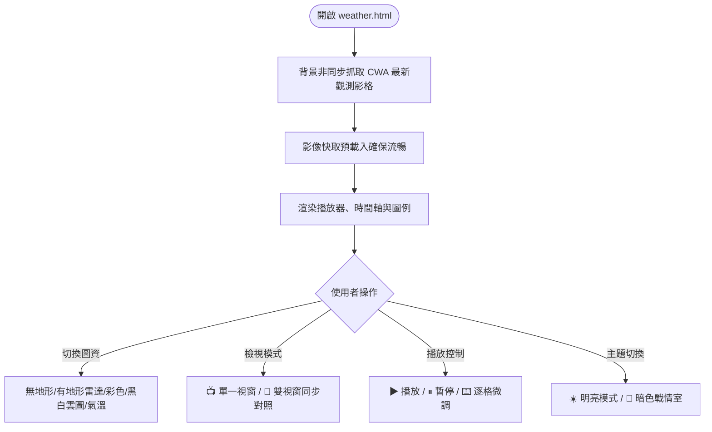

# 👋 哈囉，我是梁富翔！

歡迎來到我的 GitHub 🚀  
這裡主要用來存放與記錄我在**國立中興大學**的**週一課程（Vibe Coding）作業**及學習實作。

---

### 📌 關於我與這個空間

- 🏫 **學校**：國立中興大學 (NCHU)
- 💡 **學習主題**：Vibe Coding ｜ 現代網頁開發
- 🛠️ **使用技術**：HTML5 / CSS3 / JavaScript (ES6+)
- 📝 **內容**：課堂練習、作業作品與專案紀錄

---

## 📂 課堂作業專案介紹

### 1️⃣ 作業一：興大個人化專屬首頁 (`index.html`)
- **簡介**：包含即時動態數位時鐘、興大校園快捷系統、個人資訊與學習專注工具。
- **特色**：深色科技感毛玻璃（Glassmorphism）流體光暈視覺風格，自適應跨平台排版。

---

### 2️⃣ 作業二：中央氣象署 (CWA) 雷達回波與動態雲圖觀測儀表板 (`weather.html`)
- **簡介**：串接交通部中央氣象署開放觀測資料，打造對齊官方觀測格式的高互動性氣象儀表板。
- **特色**：
  - 📡 **多維度圖資**：無地形/有地形雷達、色調強化衛星雲圖、24小時紅外線黑白雲圖、全台氣溫熱圖。
  - 🔀 **雙視窗同步對比**：左雷達、右雲圖並排同步播放，零時差對照「雲層厚度 vs 降水強度」。
  - 🎬 **專業級播放器**：3~12 小時多段時長、時間軸拖曳（Scrubber）、0.2s~2.0s 速度調節。
  - ⌨️ **鍵盤快捷微調**：`Space`（播放/暫停）、`←/→`（逐影格倒退/前進）、`↑/↓`（調速）。
  - 🌙 **暗色戰情室主題**：經典明亮與暗色戰情室模式一鍵切換。
  - 🔒 **純前端隱私架構**：每次開啟時由前端背景自動重新抓取最新資料，不使用資料庫，且前端網頁不曝光 API Key。

#### 🔄 氣象儀表板簡易流程圖

---

## 🌐 GitHub Pages 線上預覽連結

本專案已部署於 GitHub Pages，可直接點擊下方連結線上體驗：

- 🏠 **個人作業首頁**：[https://shibu0805.github.io/HomeWork/index.html](https://shibu0805.github.io/HomeWork/index.html)
- 🌦️ **CWA 動態氣象觀測儀表板**：[https://shibu0805.github.io/HomeWork/weather.html](https://shibu0805.github.io/HomeWork/weather.html)

---

> 隨性寫扣、享受心流，透過 Vibe Coding 打造有趣的酷東西 ✨
