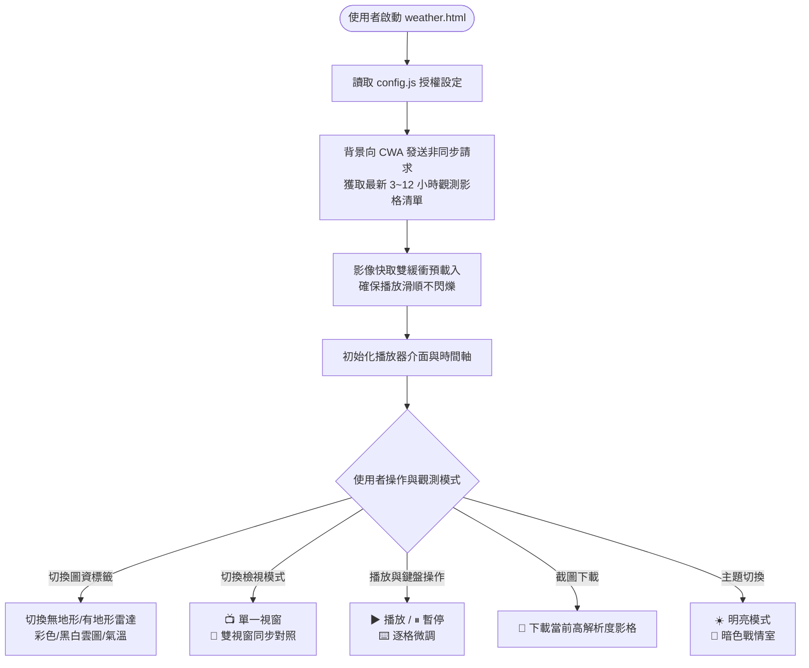

# 🌦️ 中央氣象署 (CWA) 雷達回波與動態雲圖觀測儀表板

串接交通部中央氣象署（CWA）開放觀測資料，打造對齊官方觀測格式的高互動性氣象儀表板。

---

## 🌟 核心功能特色

1. **📡 多維度觀測圖資切換**：
   - 雷達合成回波：提供「無地形」與「有地形」兩種模式，附帶官方 dBZ 降水強度色階尺。
   - 動態衛星雲圖：支援「色調強化（偵測對流雲頂溫度）」與「24小時晝夜紅外線黑白雲圖」。
   - 全台氣溫熱圖：即時呈現全台測站溫度分佈。

2. **🔀 雙視窗同步對比模式（Split View）**：
   - 一鍵切換雙視窗並列，左側雷達回波、右側衛星雲圖同步鎖定相同時間軸推進。
   - 零時差對照「雲層厚度 vs 實際降雨強度」。

3. **🎬 專業級動態影格播放器**：
   - 支援 3 小時、6 小時、9 小時、12 小時多段動態長度。
   - 影像雙緩衝預載入機制，畫面播放流暢不閃爍。
   - 時間軸拉桿（Scrubber）自由拖曳、播放速度滑桿（0.2s ~ 2.0s）、單張時間下拉切換。

4. **⌨️ 氣象專家級鍵盤快捷鍵**：
   - `Space`（空白鍵）：播放 / 暫停
   - `←` / `→`（左右方向鍵）：逐影格倒退 / 前進（慢動作逐幀分析雲雨帶變化）
   - `↑` / `↓`（上下方向鍵）：即時加速 / 減速

5. **🌙 暗色戰情室主題切換**：
   - 支援「經典明亮」與「暗色戰情室」高對比模式一鍵切換。
   - 自動儲存使用者偏好至瀏覽器 localStorage。

6. **📢 警特報廣播條 & 💾 高清影格下載**：
   - 頂部即時氣象警報跑馬燈。
   - 一鍵將當前高解析度觀測影像下載為 `.png` 存檔。

7. **🔒 純前端隱私架構（無資料庫）**：
   - 每次開啟頁面由前端背景自動向 CWA 即時抓取最新資料。
   - 獨立 `config.js` 填寫授權碼，前端網頁完全隱藏 API Key 與底層資料型態。

---

## 🔄 系統運作流程圖



---

## 📂 檔案結構

| 檔案 | 說明 |
| :--- | :--- |
| `config.js` | 🔑 CWA API Key 授權碼設定檔（在此填入金鑰） |
| `weather.html` | 🌦️ 氣象觀測儀表板主頁面 |
| `weather.css` | 🎨 專屬樣式表（含暗色模式、雙視窗佈局） |
| `weather.js` | ⚙️ 核心邏輯（API 串接、動態播放引擎、鍵盤操控） |

---

## 🚀 快速啟動

```bash
# 進入專案資料夾
cd HomeWork

# 使用 Python 啟動本地伺服器
python -m http.server 8000
```

啟動後於瀏覽器中開啟：

| 頁面 | 網址 |
| :--- | :--- |
| 🌦️ 動態氣象觀測儀表板 | `http://localhost:8000/weather.html` |
| 🏠 個人作業首頁 | `http://localhost:8000/index.html` |

---

## 🔑 如何設定 CWA API Key

1. 前往 [中央氣象署開放資料平臺](https://opendata.cwa.gov.tw/user/authkey) 申請免費授權碼。
2. 打開 `config.js`，將授權碼貼入指定位置：
   ```javascript
   const CWA_CONFIG = {
     API_KEY: "在此貼上您的授權碼",
     ...
   };
   ```
3. 存檔後重新整理 `weather.html` 即可自動連線抓取即時氣象觀測影像。

> 💡 即使尚未填入 API Key，所有觀測圖資皆可正常載入播放（直接讀取氣象署公開影像）。
